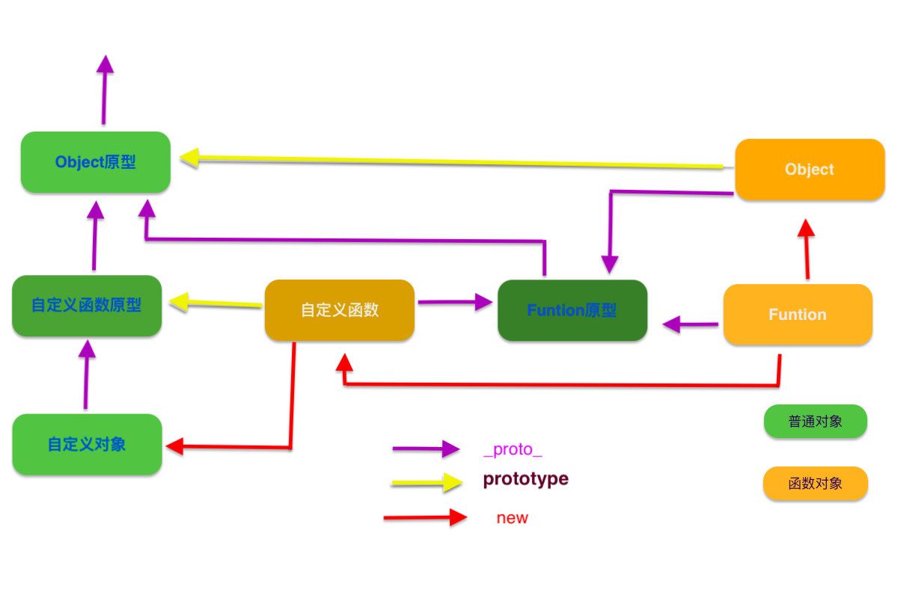

# 原型链知识

[toc]

## 前导知识

- 所有的对象都是通过```new 构造函数()```创建的
- 函数也是一个对象，是```new Funtion()```创建的
- 对象赋值是引用值之间的传递
  
## 原型

所有的函数都有原型prototype,默认是一个Object对象

## 隐式原型

所有的对象都有隐式原型```_proto_```属性，它是一个对象，指向创建该对象的构造函数的原型``prototype``
在访问该对象的成员时，如果自身没有，则沿着``_proto_``一直向上找,这就是原型链

## 原型链

所有函数的隐式原型都指向Funtion的原型

所有函数原型的隐式原型都指向Object的原型

Object的隐式原型指向Null

例如:
对象都有toString,其实来自Object，
函数的call,apply则是来自Function

        function test(){}
        a = new test()
    a._proto_.constructor == test   

**原型链关系图**:


