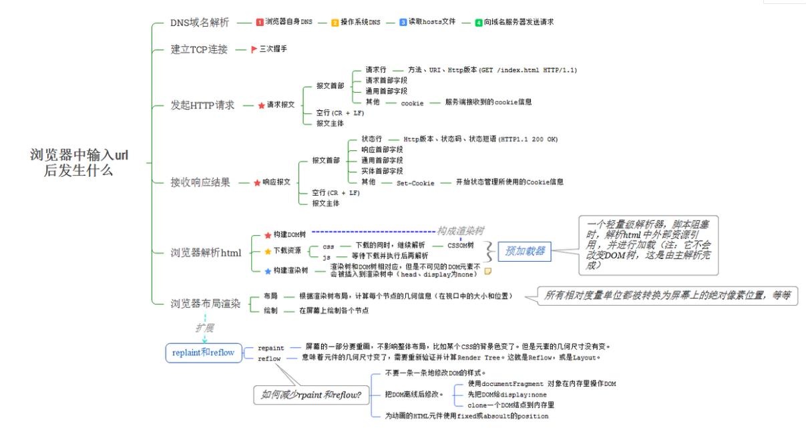

# 网络

[toc]

## IP

网络IP格式为四段式，每段0~255,都是由8个0/1组成，从[0.0.0.0] 到[255.255.255.255]
IP地址分为两个部分:网络ID、主机ID
IP分为5大类(A-E),A类范围>B>C：

- A: [0.0.0.0] ~ [127.255.255.255],约有1600+万台
- B: [128.0.0.0] ~ [191.255.255.255]t
- C: [192.0.0.0] ~ [223.255.255.255]
- D: 多播地址 [224.0.0.0] ~ [239.255.255.255]
- E:[240.0.0.1]

ABC三类统一分配

如果要让别人访问，必须有一个公网IP

## 域名及DNS

域名和IP映射,IP难以被记住,映射关系需要DNS来解析.

### 为什么国内依然习惯使用www

不使用www的被称为裸域名，只能绑定A记录，不能绑定cname，没有www,就不能起别名
裸域名的cookie作用范围大

- `*` A记录：通俗的将就是服务器的一个IP,域名对应的一个IP 地址
- `cname`：c记录是别名，比如一个网站有两个名:xxx.com和www.xxx.com，

## 浏览器输入url回车发生了什么?

1. DNS解析
   1. 查看浏览器缓存DNS，若浏览器有对应ip缓存，直接访问该ip
   2. 若无则查找本机host(host 文件)
   3. 查询联网路由器是否有域名ip缓存
   4. 如果路由器无法识别，则询问上层路由器
   5. 如果到城市级的路由器时仍无法查询到对应ip，则会到dns服务器查询
   6. 如果城市级dns服务器无法查询到该域名，则继续向上级dns服务器查找
   7. 互联网建立时有13台总DNS服务器(global)，若一直无法找到最终将在此dns服务器中找到

   8. 找到后会逐级将对应的ip返回，每级路由器都会对该ip进行缓存，下次就不会进行如此多层的查找
2. 和服务器建立连接 TCP（一次握手）
3. 客户端发送HTTP请求
4. 和服务器三次握手
5. 服务器打包数据
6. 和服务器四次挥手
7. 断开连接
8. 客户端收到数据
9. 浏览器解析数据
10. 浏览器渲染页面

## TCP三次握手

1. 客户端向服务器发送一个SYN数据包，等待服务器响应，此时客户端是SYN-send状态
2. 服务器收到SYN，验证SYN数据（转为 ACK包，在原SYN数据包+1，返回出去）,向客户端回复ACK，并为本次连接分配资源
3. 客户端收到ACK后，向服务器发送ACK，并分配资源，到此，TCP连接建立成功

## TCP四次挥手

1. 客户端发起中断连接请求（FIN报文），服务端收到后则检测是否还有数据未发送完成，先不关闭连接（Socket），可继续发送数据
2. 服务器发送ACK，告知客户端请求收到，但还未准备好，请继续等待，此时客户端进入FIN_WAIT状态，等待服务端的FIN报文
3. 服务端确认数据已发送完成，向客户端发送FIN报文，准备关闭连接
4. 客户端收到FIN报文，向服务端发送ACK告诉可以关闭连接，然后进入TIME_WAIT状态，如果服务端未收到ACK则可以重传；服务端收到ACK，关闭连接，客户端等待2 MSL后未收到回应表示服务端已关闭连接，客户端也关闭连接；至此TCP连接就关闭了

## 报文

请求报文：

1. 请求头: `Accept/Referer/Accept-Language/User-Agent/Content-Type/Content-Length/HOST/Connection/Cache-Control/Cookie.....`
2. 请求行:`请求方法 、请求url、HTTP协议及版本`
   请求主体： 携带的数据(如用户注信息，账号密码.，向服务器请求的数据名)

响应报文:

1. 响应头 ：报文协议及版本  状态码  状态描述
2. 响应行：Server/Content-Type/Transfet-Encoding/Date
3. 响应主体：响应回来的数据

`ACK` 响应包，FIN关闭连接请求
`URG紧急`
`PSH`发完
`RST重连`SYN

## 127.0.0.1 与 0.0.0.0

127.0.0.1 代表本机ip
0.0.0.0 代表不知道ip

如果不知道ip，默认转为本机，多了一次转化

## 网络模型

数据传输：数据传输实际是传送2进制数据，0代表低电平，1代表高电平，根据电平对方来接收2进制数据

物理层: 硬件
数据链路层: mac地址
网络层: IP地址，IP协议    对方的ip,自己的ip 对方的端口
运输层: TCP/UDP协议，TCP安全，会不断重试；UPD发送后不管结果
应用层：HTTP协议、DNS协议

HTTP协议**必须伴随TCP\IP协议**,层层包裹的

## TCP/UDP协议

TCP: `Transmission Control Protocol` 传输控制协议，是基于连接的协议，即正式发送数据前，需要和对方建立可靠的连接，TCP链接需要经过3次对话才能建立（三次握手）
UDP: `User Date Protocol` 用户数据报协议 ，是 ==面向非连接==的协议，与TCP协议相对应的协议

面向非连接：
在正式通信前不需要先建立连接，不管对方状态直接发送，不在乎成功与否，丢包严重，用来做视频聊天等常用

## Get 与 Post 的区别

1. 如果没有限定什么前提，不使用任何规范，只考虑语法和理论上的http协议，那么他们几乎没有区别，仅名称不同
2. 如果是基于RFC规范的：
   1. 理论上的：get 和 post具有相同的语法，但有不同的意义，get用来获取数据，post用来发送数据，其他方面无区别
   2. 实现上(浏览器):
      1. get数据在url是可见的，post在浏览器是不可见的。（url不等于地址栏，不一定会都展示在地址栏）
      2. get 对长度是有限制的，POst是无限制的
      3. get请求的数据可以收藏为书签，post不可收藏
      4. get请求后，后退，刷新无影响，post则会重新提交数据
      5. get编码类型:application/x-www-form-url,
         post有很多：
            encodeapplication/x-www-form-urlencoded
            multipart/form-data
            ...
      6. get 历史参数会被保存在浏览器中，post不会
      7. get只允许ascII编码,post不限制编码,甚至允许二进制,如文件
      8. get与post相比，安全性较差，因为url直接可见并被保存在浏览器。但在网络上，http是明文传输的，他们都不安全

## cookie\storage

HTTP协议也被称为上下文无关协议，有些数据需要进行持久化存储，就有了cookie/storage

| -    | cookie    |   sessionStorage   |   localStorage      |
| ------------------ | ------------------- | ------------------- | --------------------------- |
| 存储方式    | `document.cookie="key1=value1；max-age=1000";` | 与localStorage一致 | localStorage.name="test"只能接受字符串的value；是直接使用.属性来设置和访问;如果值为数组会被转为字符串如果想将值存储为对象可以使用 JSON.stringify配合JSON.parse来使用 |
| 读取方式   | document.cookie,需要用户对cookie字符串进行解析       | 与localStorage一致        | 使用localStorage.属性来访问,也可使用getItem获取    |
| 生命周期    | 根据用户设置的时间；默认为浏览器关闭后生命终结 | 临时的，窗口关闭时生命周期结束，仅在当前会话有效 | 永久的，除非手动删除    |
| 同源策略影响   | 不受影响  | 受同源策略影响 | 受同源策略影响 |
| 作用域   | 所有页面  | 文档源限制+窗口限制 | 文档源限制，同域名下有效 |
| 存储上限   | 约4K  | 约5M | 约5M |
| 通信   | 携带在HTTP请求头中，数据过多会影响性能，后端的数据解析操作也会增加 | 仅在浏览器中保存，不参与通信 | 仅在浏览器中保存，不参与通信 |
| 易用性   | 需要开发者自己封装  | 原生的接口访问方式较为简单，也可以封装对array和object的支持 | 原生的接口访问方式较为简单，也可以封装对array和object的支持 |
| -   | -  | - | navigator.cookieEnable检测是否启用cookie;不建议出现空格，逗号，分号等使用encodeURIComponent和decodeURIComponent来进行编码解码 |
