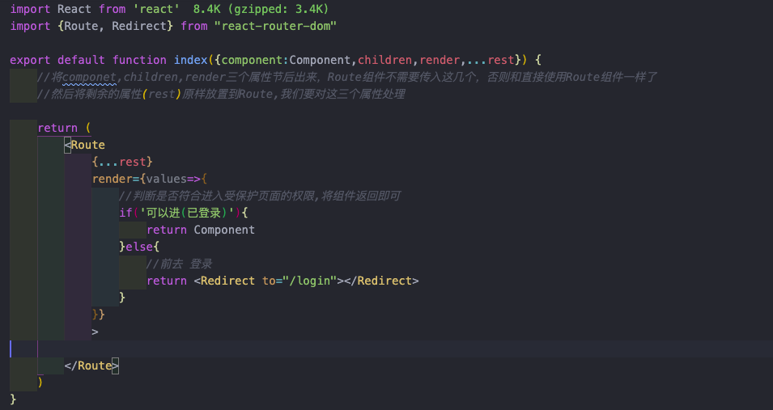

# 路由

[toc]

## 路由信息

Route组件当匹配到地址时，会将路由信息以属性（props）传入组件，该信息对开发者是隐藏的，可通过props访问,该信息包含:history、match、location

### history

非window.history,但是其方法和window.history一致

为何不使用window.history?
因为route有hash和history两种模式，
使用window.history进行操作React无法感知路由变化

+ push:将某地址推入历史记录栈,(href:新地址,data:附加数据)
+ replace
+ go
+ forward
+ back

### location

和history.location完全一致，与window.location不同，记录了当前地址的信息
通常使用query-string库解析格式化信息:queryString.parse(props.location.search)

### match

路由匹配的相关信息，是否精确匹配、path、url、params
是否精确匹配：配置的路径和当前的路径是否完全一致，不是看是否设置了exact
params:
```<Route path="/news/:year/:month/:day"></Route>``` /news/2012/12/21
```<Route path="/news-:year-:month-:day"></Route>``` /news-2012-12-21
```<Route path="/news-:year-:month?-:day?"></Route>``` 可选
```<Route path="/news-:year(\d+)-:month(\d+)-:day"></Route>```参数格式限制

path-to-regExp库,路径正则转真正的正则

path可为数组，多路径匹配

### 非路由组件获取路由信息

1.将路由信息从父级传递
2.使用react-router提供的withRouter高阶组件，该HOC会注入路由信息

## 向页面传递数据方式

1. state
2. 利用search,把数据放到?后 ?a=1&b=2
3. 利用hash,把数据放到#后   #a=1&b=2
4. 利用params,把数据填写到路径  /2020/02/02


##  嵌套路由 

1. 在子组件中嵌套孙组件，需要带上子组件的路由名
2. 孙组件是需要知道从哪个组件过来的（孙组件可能在多个路由中被使用）
3. route组件会被注入history\match\path等属性，在match属性中，path代表改route组件设置的path(规则)，url代表的匹配到当前路径的匹配部分,url就可以当做是父组件的路由,也就能知道是从哪个组件进入的该路由
4. 可以使用${match.url}/page来设置路由path属性
5. 可创建一个专用配置路由的文件


## 受保护的路由

1. 部分页面需要经过登录之类才能访问，页面受到保护
2.route组件的render属性,它和children差不多，但是运行时不同，render需要匹配上才会运行，而children一定会运行
3. render属性需要返回一个节点\组件等
4. 自定义一个路由组件ProtectdRoute 
    
5. 登录后跳回页面
   1. 在前往登录页时，将页面路径参数通过url携带过去，登录后，依据改参数进行回跳
   2. 可在前往登录页时,将路径通过属性传过去,登录成功通过该属性进行回跳

## 实现vue路由

1.vue是静态路由，React是动态路由

实现

```
    //routerConfig.js(vue的router.js)
    export default [
        {
            path:'/',
            name:'home',

            component:Home
        },
        {
            path:"/news",
            name:"news",
            component:New,

            children:[
                {
                    exact:true,
                    path:"/",
                    name:'newsHome',
                    component:newsHome
                },
                {
                    path:"/detail",
                    name:'detail',
                    component:Detail,
                    exact:true
                }
            ]
        },
    ]
```

``` 
    //app.js   页面dom
    <Router>
        <nav>
            <Link to="/">首页</Link>
            <Link to="/news">新闻</Link>
        <nav>
        <div>
            <Switch>
                <RouteRouter />
            </Switch>
        </div>
    <Router>

```

```
    //RouteRouter.js
    //类似router-view
    //作用：根据路径渲染顶级页面
    //在需要显示内容的地方，均需要使用{this.props.children}进行渲染，

    import React from "react"
    import {Route,Switch}
    import routes from "RouterConfig.js"

    function getRoute(routes,basePath){     //
        if(!routes) return null;
        const RouteArr = routes.map((el,index)=>{
            const {children,name,path,component:Component,...prop} = el;  \
            //不要children,否则无论是否匹配，都会运行

            const newPath = `${basePath}${path}`.replace('/\/\//g','/')
            //path需要拼接上父路由的路径,注意处理爽斜杠

            <Route key={index} {prop} 
                path={newPath}
                //子组件
                render=>{values=>{
                    //  递归，获取子组件列表
                    return <Component  {...values} >
                            {getRoute(el.children,newPath)}
                        </Component>
                }}
                >

            <Route/>
        })

        return <Switch>
                    {RouterArr}
                </Switch>
    }

    export default  function RouteRouter{
        return {
            <>
                {/*返回一组Route*/}
                getRoute(routes,'/')
            </>
        }
    }

```

以上三个文件就实现了vue的路由模式
下面封装link,实现可使用name跳转,不考虑传参(传参需要path-to-regexp库)

```
    RouterLink
    //增强Link组件
    import {Link } from "react-router-dom"
    import routes from "routerConfig.js"
    export default function RouterLink({to,...rest}){
        if(to && typeof to !='string'){
            //从配置文件查找name对应的path
            to.pathname = getPathFromName(to.name,'',routes);
            if(!to.pathname){
                throw new Error('name属性无效')
            }
        }
        return <Link to={} {...rest}>

                </Link>
    }

    //根据name查path
    function getPathFromName(name,baseUrl,routes){
        for(const route of routes){
            let newPath = (baseUrl + item.path).replace(/\/\//g,'/');
            if(item.name == name){
                return newPath
            }else{
                if(Array.isArray(item.children)){
                    const cPath  = getPathFromName(name,newPath,item.children)
                    if(cPath) return cPath;
                }
            }
        }
    }
```

使用:
  ```  <RouterLink to={{name:'Home'}}></RouterLink>```


## 导航守卫

通过==history.listen==监听路由变化，添加一个监听器，当地址变化时，会调用传递的函数，定义在componentDidMount中

- 参数：函数，
  - arg1:location对象。记录当前地址信息
  - agr2:action,字符串，标识进入该地址的方式
    - POP:出栈
      - 点击浏览器的后退、前进
      - history.goBack()
      - history.go()
      - history.goForward()

    - Push:入栈
      - Link组件超链接
      - history.push()

    - Replace:替换
      - history.replace()
- runtime:即将在跳转到页面时
  
- 返回结果，一个函数，可调用该函数停止监听

==history.block==:设置一个阻塞，并同时设置阻塞消息，当页面发生跳转时，会进入阻塞，并将阻塞消息传递到路由根组件Router的getUserConfirmation中

Router根组件(BrowserRouter、HashRouter)的getUserConfirmation:==必须有阻塞才会生效==，参数为:```阻塞消息、callback```，当设置callback参数为true时，路由将会跳转，否则不会
阻塞消息可为函数，返回字符串,参数：location,actions,
