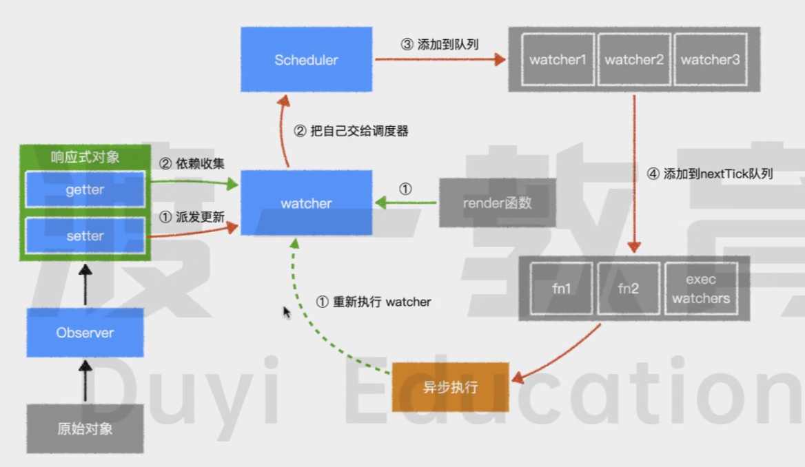

# 面试集锦

[toc]

## 虚拟dom

### 什么是虚拟DOM

虚拟dom本质就是一个普通的js对象，用于描述视图的界面结构

vue中每个组件都有render函数，每个render函数都会返回一个虚拟dom树，因此每个组件都对应了一颗虚拟dom树

### 为什么需要虚拟dom

在vue中，渲染视图会调用render函数，这种渲染不仅发生在组件创建时，同时发生在视图依赖的数据变化时。
如果在渲染时直接使用真实dom,真实dom的创建、更新、插入等操作会带来大量的性能消耗，降低渲染效率
**使用虚拟dom代替真实dom主要为了解决渲染效率问题**

### 虚拟dom如何转为真实dom？

在一个组件实例首次被渲染师，先生成虚拟dom树，然后根据虚拟dom树创建真实dom，并把真实dom加载到页面合适位置，此时虚拟dom便对应一个真实dom

如果一个组件受响应式数据变化的影响，需重新渲染时，它仍会重新调用render，创建一个虚拟dom树，用新树和旧树对比，找到最小更新量，然后更新必要的虚拟dom节点，最后根据更新过的虚拟节点，修改对应的真实dom
以此保证真实dom达到最小改动

### 模板与虚拟dom的关系

vue中有一个compile模块，主要负责将模板转为render函数，而render函数调用后将得到虚拟dom

编译过程：

1. 将模板字符串转为AST
2. 将AST转为render函数

如果使用传统的引入方式,则编译时间发生在组件第一次加载时,称为运行时编译
如果是vue-cli默认配置，编译发生在打包时，称为模板预编译
编译时一个极其耗费性能的操作，预编译可以有效的提高运行时性能，并且因运行时已无需编译，vue-cli打包时会排除掉vue的compile模块，减少打包体积
**模板的存在仅仅是为了方便开发者书写代码**

vue最终运行时，需要的是render函数而非模板，所以在虚拟dom中模板的各种语法均不存在，都变成了虚拟dom的配置

## v-model

v-model是一个语法糖，最终会生成一个属性和一个事件，不同的元素生成不同的时间，如input生成的是value+input时间，radio生成的是checked和change事件
,普通组件用户可自定义，通过设置`model:{prop:'绑定的属性',event:'绑定的事件}`来配置

vue2实现使用了`Object.defineProperty`

## 数据响应原理

### Observer

用于把普通对象转为响应式对象，Observer通过Object.defineProperty将每个属性都转为带有getter和setter属性的对象，vue访问时就能够进行其他操作

Observer为vue内部构造器，可通过`Vue.observable()`间接使用该方法

Observer发生`beforeCreate`后,`created`前，因此仅能检测到当前对象，无法监测到将来动态增加或删除的属性,vue提供了`$set` / `$delete`进行此操作

对于数组Vue会更改其隐式原型，重写部分方法，为了监听可改变数组的方法对数据进行更改
[见源码81行](../vue2/MVVM原理/core/instance/proxy.js)

### Dep

如何知道读取属性/变化属性时，进行哪些操作呢？更新谁呢？
读取属性/属性变化时要进行的操作,vue会为响应式数据每个属性、对象本身、数组创建Dep实例，每个Dep实例都有下列两个能力：

1. 记录依赖，谁在使用，当读取响应式数据某个属性时，会进行依赖收集(getter时)，`dep.depend()`
2. 派发更新，改变了要通知谁，当改变某个属性时，会派发更新(setter时) `dep.update()`

### Watcher

Dep如何如何知道谁在使用呢？

当某个函数执行过程中，用到了响应式数据，响应式数据是无法知道哪个在使用的

因此vue不直接执行函数，而是交给watcher，watcher是一个对象，每个这样的函数执行时都创建一个watcher，通过watcher去执行

watcher会设置一个全局变量，让全局变量记录当前负责执行的watcher等于自己，然后再去执行函数，函数执行过程中，如果发生了dep.depend(),那么Dep就会把这全局变量记录，表示有一个watcher使用到了该属性

当Dep派发更新时，会通知记录的所有watcher

每个vue组件都对应了至少一个watcher，    记录了该组件的render函数
watcher首先会把render函数运行一次，以收集依赖，所以render中用到的响应式数据就会记录该watcher

数据变化时，dep通知该watcher，watcher重新运行render，让界面重新渲染的同时重新收集依赖

### Scheduler调度器

Dep通知watcher后，如果watcher执行重新运行对应的函数，可能导致函数频繁运行，效率低下，如何解决呢？如一个对象的多个属性生成的多个watcher

watcher收到dep派发的更新时，不是直接运行对应函数的，而是交给调度器

调度器维护一个执行队列，该队列同一个watcher仅存在一次，队列中的watcher不是立即执行的，而是通过nextTick的工具方法，把这些需要执行的watcher放入事件循环的微队列，nextTick通过promise实现

所以render函数是异步执行且在微队列中

### 流程



## Diff算法

### diff的概念

当组件创建和更新时，vue均会执行内部的update函数，该函数使用render函数生成虚拟dom树，组件会指向新的虚拟dom树，然后将新旧两棵树进行对比找到差异点，最终更新到真实dom

对比差异的过程就是diff，vue内部通`patch`函数完成该过程

在对比时，vue采用深度优先，逐层对比

在判断两个节点是否完全相同时，vue通过判断虚拟节点的key和tag来进行判断的,input会多判断type:

```jsx
    <h1>123</h1>
    <h1>456</h1>
    //上面两个h1被认为是相同的:
    // { tag:'h1',key:undefined } 与 {tag:'h1',key:undefined}

    <input type="radio" />
    <input type="text" />
    // 上面两个被认为是不同的，type值不同
```

### diff的流程

1. 首先对根结点进行对比，如果想吐则将旧节点关联的真实dom的引用挂到新节点上
2. 然后根据需要更新属性到真实dom
3. 然后对比其子节点数组，如果不相同，则按新节点的信息递归创建所有真实dom，同时挂到对应的虚拟节点
   1. vue对每个子节点数组使用了两个指针，分别指向头和尾
   2. 然后不断向中间靠拢来进行对比，目的是尽量复用真实dom，尽量少销毁和创建真实dom
   3. 如果发现相同，则进入和跟节点一致的对比流程，如果不同，则移动真实dom到合适位置
4. 移除旧的dom
5. 按该流程递归对比，直到整棵树对比完成

### diff的时机

当组件创建时，以及依赖的属性、数据变化时，会运行一个函数，该函数将完成下列两件事：

1. 运行`_render`函数生成一颗新的虚拟dom树（`vNode tree`）,_render也就是render函数
2. 运行`_update`函数，传入虚拟dom根节点，对新旧两棵树进行对比，最终完成对真实dom的更新

diff就发生在`_update`的运行过程中

```js
    // 伪代码
    function Vue(){
        var updateComponent = () => {
            this._update(this._render()); // 更新时调用_render生成新的树，交给_update进行diff更新
        }

        new Watcher(updateComponent); // 监听执行过程，收集依赖

        _update(vNode){
            const oldVNode = this._vnode; //拿到旧树
            this._vnode= vNode; //将虚拟dom指向最新的
            // diff操作
            if(!oldVNode){ // 不存在旧树，组件首次加载
                this.patch(vNode);
            }else{ //有旧树，递归
                this.patch(vNode,oldVNode);
            }
        }

        patch(newVNode,oldVNode){

        }
    }
```

### _update函数做了什么？

`_update`函数接受一个`虚拟dom`树为参数，就是新生成的虚拟dom树
`_update`函数通过当前组件的`_vnode`属性，拿到旧的虚拟dom树

1. `_update`函数首先会给组件的`_vnode`属性重新赋值，让它指向新的`虚拟dom树`（见伪代码）
2. 判断旧树是否存在
   1. 不存在，说明为组件首次加载，通过内部的`patch`函数直接遍历新树，为每个节点生成`真实dom`，挂在到每个节点的`elm`属性上
   2. 存在，通过patch对新旧两棵树进行对比，以达到两个目标
      1. 完成对比，找到最小更新量
      2. 让树的节点完全对应真实dom

### patch流程

相关术语：

【相同】: 两个标签的tag、key均相同，input元素会多判断type值是否相同
【新建元素】：根据一个虚拟节点信息，创建一个真实dom，并挂载到虚拟节点的`elm`上
【销毁元素】： `vnode.elm.remove()`
【更新】：对两个虚拟节点对比更新，仅发生在虚拟节点**相同**的情况下，不同会直接创建新的替代掉
【对比子节点】：对两个虚拟节点的子节点进行对比

1. 根节点进行比较（判断两个根节点是不是【相同】）
   1. 不相同：
      1. 新节点递归【新建元素】
      2. 旧节点【销毁元素】
   2. 相同，进入【更新】流程
      1. 将旧节点的真实dom赋值到新节点的elm：`newVnode.elm = oldVnode.elm`
      2. 对比新旧节点的属性，有变化的更新到真实dom
      3. 两个节点对比完进入到【对比子节点】流程

2. 对比子节点,(双指针)
    + 尽量啥也别做
    + 退而求其次，尽量仅改动属性
    + 再退而求其次，尽量移动元素，而非删除/创建
    + 实在不行才创建/删除

## 生命周期详细版

1. 首先执行一些初始化操作，主要是设置一些私有属性到实例中
2. 运行**生命周期`beforeCreate`**
3. 进入注入流程，处理属性、computed、methods、data、provide、inject，最后使用代理将它们挂到实例上
4. 运行**生命周期`created`**
5. 生成render函数，如果有配置，直接使用配置的render,如果没有则使用compiler编译器将模板编译为render
6. 运行**生命周期`beforeMount`**
7. 创建一个Watcher，传入一个函数`updateComponent`,该函数会运行`render`,把得到的`vnode`再传入`_update`函数执行(见伪代码)
   1. 在执行`render`函数过程中，会收集所有依赖，将来依赖变化时重新运行`updateComponent`函数
   2. 在执行_update函数的过程中，触发patch函数，当前是创建阶段，无旧的虚拟dom树，直接为当前虚拟dom树每个**普通节点**生成elm属性，即真实dom
   3. 如果遇到**创建组件的节点**则进入组件实例化流程，该流程与创建vue实例流程基本一致(即本流程),最终将创建好的组件实例挂载vnode的`ComponentInstance`属性中，以便复用
8. 运行生命周期`mounted`

```js
    //伪代码
    function Vue(options){
        var data = option.data;
        observer(data); // 转为响应式数据
        var methods = option.methods;
        // 将数据挂再到this上，
        for(prop in data){
            Object.defineProperty(this,prop,{
                get(){
                    return this[prop]
                }
                set(val){
                    data[prop] = val
                }
            })
        }
        // 将method挂到this
        Object.entries(methods).forEach(([methodName,fn])=>{
            this[methodName] = fn.bind(this)
        })

        var updateComponent = () => {
            this._update(this_render()); // 生成新的虚拟dom , 再进行diff
        }

        new Watcher(updateComponent); // 收集依赖


    }
```

9. 数据变化后，所有依赖该数据的watcher都将重新运行
   1. watcher将被调度器放到nextTick队列，避免多个依赖的数据同时    改变后多次执行
   2. 运行**生命周期.beforeUpdate**
   3. `updateComponent`函数重新执行，执行中去掉之前的依赖重新收集
   4. 在执行_update函数时，触发patch函数
   5. 将两颗虚拟dom树进行对比
   6. 普通html节点的对比会导致真实节点被创建、删除、移动、更新
   7. 组件节点的对比将导致组件被创建、删除、移动、更新
   8. 当新组件需要被创建时，进入实例化流程
   9. 当组件需要被删除时，将调用旧组件的`$destroy`方法删除组件，该方法会先触发**生命周期`beforeDestroy`**，然后递归调用自组件的`$destroy`方法。最后触发**生命周期`destroyed`**
   10. 组件属性更新时， 相当于重新调用组件的`updateComponent`函数，进入重新渲染流程。
10. 运行**生命周期`updated`**

## computed详解

### computed与methods差别

简易版:

1. 使用时computed需当作属性，methods需当作方法
2. computed可具有getter/setter，可复制,methods不行
3. computed不可接受参数
4. computed具有缓存

原理版：

1. vue对`methods`的处理较简单，仅遍历methods中的每个属性，将其使用bind绑定当前组件实例后复制其饮用到组件实例即可
2. vue对`computed`的处理复杂一点：
   1. 组件实例出发生命周期函数`beforeCreated`后，会对`computed`进行处理
   2. 遍历`computed`配置的所有属性，为每个属性创建一个`watcher`对象，并传入一个函数，该函数本质就是`computed`配置的`getter`，如此`getter`运行过程就会收集依赖

      ```js

            computed:{
                fullName(){
                    return lastName + firstName
                }
            }
            // 在源码中如下伪代码

            fullName: Watcher getter
                    value: undefined
                    dirty:true

            Objet.defineProperty(vm,'fullName',{
                get(){
                    // 运行watcher
                    if(watcher.dirty){// 脏值
                        // 重新计算
                    }else{
                        return watcher.value
                    }
                }
            })
      ```

   3. 和渲染函数不同，为了计算属性创建的`watcher`不会立即执行(因为计算属性可能不被渲染函数使用,不应该执行),因此用`watcher`中的==lazy==属性设置为true，表示不会立即执行，而渲染函数的watcher该值为false
   4. 受到lazy的影响，watcher内部会保留两个关键属性来实现缓存：==value==与==dirty==
      1. `value`用于保存watcher运行的结果，也就是常说的computed缓存，受lazy的影响，该值最开始为`undefined`
      2. `dirty`用于表示当前的`value`是否已经过时,即是否为脏值，如果为脏值会重新进行计算，如果不为脏值，直接使用value。受`lazy`影响，该值最开始是true，`watcher`创建好知乎，vue会使用代理模式，将计算属性挂载到组件实例中
   5. 当读取计算属性时，vue检查其对应的`watcher`是否是脏值(`dirty`)，如果是，则运行函数，计算依赖，并得到对应的值，保存到`watcher`的value中，然后设置`dirty`为`false`，最后返回
   6. 注意：收集依赖时，依赖的数据不仅会收集到计算属性的watcher,还会收集到组件的watcher
   7. 计算属性的依赖发生变化时，先触发watcher执行，它仅需设置dirty为true即可，不做其他操作
   8. 依赖收集了组件的watcher，因此组件也会重新渲染，而渲染又读取了computed，但因此时dirty已为false，所以内部直接使用之前的value值
   9. 计算属性对setter的处理仅仅是当设置计算属性时，直接运行setter而已

