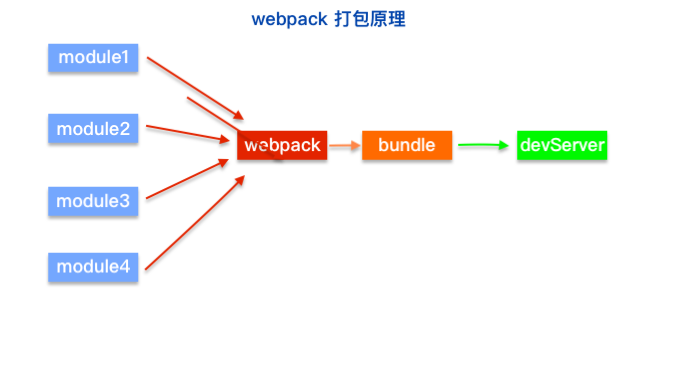
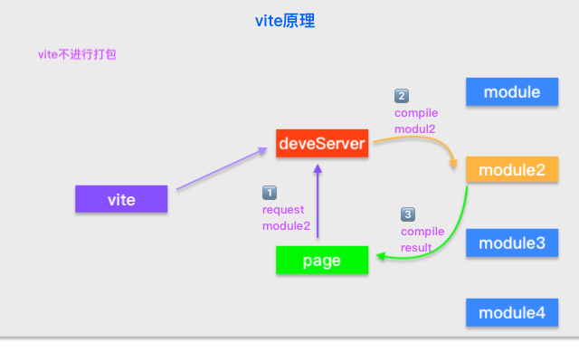

# vite

[toc]

## 什么是vite

vite在法语中意思为==快==，该构建工具由vue团队开发。
由于webpack在构建项目时，运行速度极慢，故诞生了该构建工具，效率提升极大，热启动功能，首次启动后，后续启动均为秒启动，webpack则每次都需要重新构建，效率较低

## 安装vite

使用命令```npm install -g create-vite-app```或```yarn add create-vite-app```

## 使用vite

在项目下使用```npm init vite-app 项目名字```

## 与webpack的对比

webpack先从入口文件，查找相关依赖，然后进行打包，启动服务器，请求服务器时，将打包结果返回



vite不进行打包，直接开启服务器，使用的koa服务器,根据不同请求处理需要的模块，对该模块进行实时编译。
由于现代浏览器本身支持ESModule，会自动向依赖的Module发出请求，vite利用了这一点，将开发环境下的模块文件，作为浏览器要执行的文件，而不是像webpack进行打包合并

由于vite在启动时，不需要打包，也就意味着不需要分析模块的依赖，不需要编译，**因此启动速度非常快**

当浏览器请求某个模块时，再根据需要，对模块内容进行编译，这种动态编译的方式，极大缩减了编译时间，项目越复杂，模块越多，vite的优势越明显

在HMR(hot module replace，热更新)方面，当改动一个模块后，仅需让浏览器重新请求该模块即可，而webpack需要把该模块的相关依赖一次全部编译。

当需要打包到生产环境时，vite使用传统的rollup进行打包，因此，vite的优势在于开发阶段，另外，vite利用的是ESModule，所以在代码中**不可使用commonJS**




## 配置

vite.config.js:

build:{
    target: es2015 //设置构建目标，最低es2015
    script:{
        "preview":"vite preview --port 8081"
    }
}
base:"/" //公共基础路径 ，使用页面动态链接时可使用```import.meta.env.BASE_URL```


## 构建后本地预览

可以使用 `npm run preview`来预览生产环境打包后的项目


## 环境变量

Vite 在一个特殊的 import.meta.env 对象上暴露环境变量
有一些内建变量：
import.meta.env.MODE: {string} 应用运行的模式。

import.meta.env.BASE_URL: {string} 部署应用时的基本 URL。他由base 配置项决定。

import.meta.env.PROD: {boolean} 应用是否运行在生产环境。

import.meta.env.DEV: {boolean} 应用是否运行在开发环境 (永远与 import.meta.env.PROD相反)。

Vite 使用 dotenv 从你的 环境目录 中的下列文件加载额外的环境变量：
```

.env                # 所有情况下都会加载
.env.local          # 所有情况下都会加载，但会被 git 忽略
.env.[mode]         # 只在指定模式下加载
.env.[mode].local   # 只在指定模式下加载，但会被 git 忽略
```
只有以 VITE_ 为前缀的变量才会暴露给经过 vite 处理的代码

应该将 .local 添加到你的 .gitignore 中

Vite 为 import.meta.env 提供了类型定义。想要在代码中获取这些以 VITE_ 为前缀的用户自定义环境变量的 TypeScript 智能提示:

在src目录新建env.d.ts:

interface ImportMetaEnv {
  VITE_APP_TITLE: string
  // 更多环境变量...
}