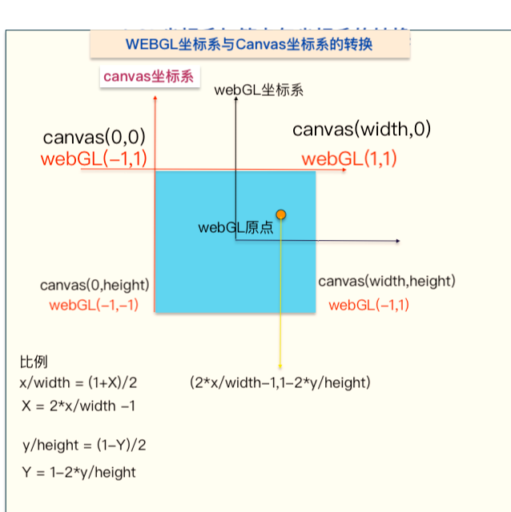

# 基础知识

[toc]

## CPU与GPU

1.CPU(中央处理器)分为控制、存储、计算三个单元，常说的核就是指计算单元的数量.
2.GPU(图形处理器)，也就是显卡。

## 背景

WebGL是一种3D绘图标准,webgl程序由Javascript与OpenGL Shading Language(GLSL)编写的着色器代码组成,WebGl是用来实现2d3d动画效果的。

## 图形管线/渲染管线

webgl的工作方式与流水线类似，将绘图过程分成多个步骤，当前步骤只对前一步骤的巾帼进行处理，然后将处理后的结果传递给下一步骤，最终渲染到2d屏幕上，这种渲染方式即图形管线/渲染管线.

## GPU渲染管线的主要处理过程

1.首先进入==顶点着色器==阶段，利用GPU的并行计算又是对顶点逐个进行坐标变换
2.然后进入图源装配阶段,将顶点按照图源类型进行组装成图形
3.接下来到光栅化阶段，光栅化阶段将图形用不含颜色信息的像素填充
4.在之后进入==片元着色器==阶段，该阶段为像素着色器，并最终显示到屏幕上
**图源:WebGL只能绘制三种基本的图形，也被称为图源,即点、线段、三角形**

## 绘制点

1.获取WebGL上下文,和canvas一致，仅将getContext的值改为webgl;

2.初始化着色器
着色器代码的语法：

- `attribute vec4 a_position`; attribute为存储限定符 vec4为类型 a_position为变量名

存储限定符：变量的类型，顶点变量、可变变量、全局变量···
    - attribute：传输的是与顶点有关的数据
    - uniform：传输的是对于**所有**顶点都相关（或无关
的数据（全局变量）
    - textures：纹理，纹理是一个数据序列，可在啊着色程序运行中随意读取，大多数情况存放的是凸显工属具，但是纹理仅仅是数据序列，也可随意存放除颜色外的其他数据
    - Varing：可变量，一种顶点着色器给片元着色器传值的方式，依照渲染的图源是点，线段还是三角形，顶点着色设置的可变量会在片元着色器运行中获取不同的插值
  
### 变量类型

    -顶点着色器
      - 矢量： 
        - vec2,vec3,vec4 具有2、3、4个浮点元素的矢量
        - ivec2,ivc3,ivec4 具有2、3、4个整形元素的矢量
        - bve2,bve3,bve4 具有2、3、4个布尔值元素的矢量

      - 矩阵：
        - mat2,mat3,mat4 2*2、3*3、4*4的浮点数元素矩阵（分别具有4\9\16个元素）,二维、三维、四维

      - 内置变量：
        -  vec4 gl_Position 标识顶点位置,必须被赋值，否则着色器无法工作
        -  float gl_pointSize 标识点的尺寸（像素数），默认为1.0
    
    -片元着色器
        - vec4 gl_FragColor  **片元着色器内置变量**，指定片元颜色，rgba格式

### 代码演示

#### 顶点着色器

    <script type="notJs" id="vertex">
        //顶点着色器代码，设置type不为javascript的任意值
        void main(){
            gl_Position = vec4(0,0,0,0);    //顶点位置
            gl_PointSize = 20.0;
        }
    </script>

#### 片元着色器

    <script type="fragment" id="fragment">
        //片元着色器代码
        void main(){
            gl_FragColor = vec4(255,0,0,0);
        }
    </script>

#### JAVASCRIPT

    <script>
        //JS代码
        var canvas = document.getElementById('oCanvas');
        var gl = oCanvas.getContext('webgl');
        if(!gl){
            document.write('请使用现代浏览器');
        }
        //获取着色器代码文本
        var vertex = document.getElementById('vertex').innerText;
        var fragment = document.getElementById('fragment').innerText;
        var vertexShader = createShader(gl,gl.VERTEX_SHADER,vertex);
        var fragShader = createShader(gl,gl.FRAGMENT_SHADER,fragment);

        //创建程序，链接着色器
        var program = createProgram(gl,vertexShader,fragShader);

        gl.useProgram(program);

        //绘制
        gl.clearColor(255,0,0,1);//清空画布
        gl.clear(gl.COLOR_BUFFER_BIT);//清空颜色缓冲区

        gl.drawArrays(gl.POINTS,0,1);
        //mode  绘制方式，gl.POINTS,gl.LINES,gl.LINE_STRIP,gl.LINE_LOOP,gl.TRIANGLES,gl.TRIANGLE_STRIP,gl.TRIANGLE_FAN
        //first 指定从哪个顶点开始绘制
        //count 指定绘制需要用到多杀个顶点，整数
        //无返回值

        /**
        *@param gl webgl对象
        *@param type 着色器类型,
        *@param source 图源.字符串类型
        * 创建着色器
        */
        function createShader(gl,type,source){
            //创建着色器
            var shader = gl.createShader(type);
            //添加资源
            gl.shaderSource(shader,source);
            //编译着色器代码
            gl.compileShader(shader);
            var status = gl.getShaderParameter(shader,gl.COMPILE_STATUS);  //第二个值是状态
            if(status){
                return shader
            }else{
                //编译失败:
                console.log(gl.getShaderInfoLog(shader));//查看编译信息
            }
        }

        function createProgram(gl,vertexShader,fragmentShader){
            var program = gl.createProgram();
            //绑定着色器,参数：程序，顶点着色器，片元着色器
            gl.attachShader(program,vertexShader);
            gl.attachShader(program,fragmentShader);
            //链接
            gl.linkProgram(program);
            // return program
        }
</script>

## 坐标系区别

canvas的坐标系为画布左上角为中心点，webGl以画布中心为中心点，且宽度区间为-1~1之间，因此需要进行坐标转换

**笛卡尔坐标系**: - ;
**webGL坐标系**:中心为(0,0),横向为x轴，纵向为y轴，范围为-1 ~ 1;
**canvas坐标系**、**图像坐标系**:左上角为(0,0),向右为x轴，向下为y轴;
**纹理坐标系**:图像左下角为（0,0）,向上为t轴(y),向右为t(x)轴，范围为0~1;

区分纹理坐标系与webGL坐标系，纹理坐标系叫s轴和t轴;



## 缓冲区对象

多个点组成的图像时，一次性将所有顶点传入缓冲区，供顶点着色器使用

## 三角形

## 三角带

6个顶点，123相连->234相连->345相连->456相连

## 三角扇

1个点出发，5个点分别与它相连


## 矩形

```gl.drawArrays(mode,first,count)```

- mode:指定绘制方式
  - gl.POININTS 点
  - gl.LINES 线
  - gl.LINE_STRIP 线段
  - gl.LINE_LOOP 回路
  - gl.TRIANGLES 三角形
  - gl.TRIANGLE_STRIP 三角扇
  - gl.TRIANGLE_FAN
- first 顶点起点
- count 需要多少个顶点

gl.drawElements(mode,count,type,offset)

- type:指定索引缓冲区的值类型
  - gl.UNSIGNED_BYTE 无符号8位整数值
  - gl.UNSIGNED_SHORT 无符号短整形16位
- offset:指定索引数组红开始绘制的位置，以字节为单位

可使用三角形绘制(6个顶点)，三角带绘制(4个顶点)，三角扇绘制(5个顶点)

## 圆

```
function circlePoints(x,y,r,n){
    var points = [];
    points.push(x,y,Math.random(),Math.random(),Math.random(),Math.random());
    for(var i =0 ;i<= n;i++){
        var arg = i * Math.PI * 2 / n;
        var pointX = r * Math.cos(arg) + x;
        var pointY = r * Math.sin(arg) + y;
        points.push(pointX,pointY,Math.random(),Math.random(),Math.random(),Math.random())
    }

    return points;   
}
```

draw时 顶点数记得为n+2

## 环

可使用大圆和小圆,或者三角形+梯形实现(推荐),或者三角带
梯形[0,1,2,2,1,3,3,1,4]

## 纹理

### 纹理坐标系


