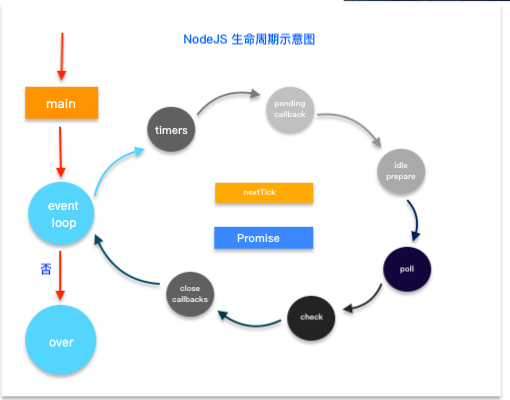

# node 生命周期

[toc]

## 执行过程



从主线程进入后，事件循环需要经过6个阶段(队列)，进入队列后查看有没有可执行队列，执行完清空队列后进入下一阶段

6个队列全部为宏任务，nextTick/Promise为微任务

### timers

存放计时器的callback

### pending callbacks

### idle prepare

### poll

==轮询队列==,除了timers,checks，绝大部分callback都被放在此队列

+ 如果poll中有回调，一次执行回调，直到清空队列
+ 如果没有队列中没有回调
  + 等待其他队列种出现回调，结束该阶段，进入下一阶段
  + 如果其他队列也没有回调，**持续等待**，直到出现回调（ajax等）

### check

==检查阶段==，使用setImmediate的回调,

setImmediate类似于setTimeout 0,但实现不同，效率比setTimeout高得多

```javascript
    // 面试题

    fs.readFile('index.js',()=>{
        setTimeout(console.log(1),0)
        setImmediate((console.log(2)))
    })
    //output: 2,1
    // poll 等待文件读取完毕
    // 将setTimeout 加入timers,将setImmediate加入check
    // poll 检测到其他队列有任务，立即结束本阶段，进入下一阶段check
    // 执行console.log(2),再循环进入timers,执行console.log(1)
```

### close callbacks

### nextTick & Promise

`process.nextTick`

微队列，nextTick优先于Promise
**事件循环每次打算执行一个回调前，必需先清空nextTick和promise队列**

```javascript
   setImmediate(()=>{
       console.log(1)
   })

   process.nextTick(()=>{
       console.log(2);
       process.nextTick(()=>{
           console.log(6)
       })
   })

   console.log(3)

   promise.resolve().then(res=>{
       console.log(4)
       process.nextTick(()=>{
           console.log(5)
       })
   })

   // 答案:3 2 6 4 5 1
   // 同步输出3
   // nextTick中加入2，进入下一步需先清空 2
   // 再次加入6 ,进入下一步前先清空 6
   // promise回调4 
   // nextTick加入5
   // 进入下一步先清空微队列 5
   // event loop 执行到check时，输出1
```
