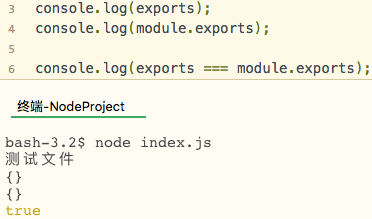

# 后端的规范与思想

[toc]

## 分层

* Web层 (接收和发送HTTP请求的，封装；别名controller层)
* 业务逻辑层 (别名服务层,文件常以xxxService为名)
* DAO层 （Date Access Object,数据访问对象,对对象进行操作，存储是对象转为数据，读取是数据转为对象）
* 持久层 (持久层，将数据长久的保存，如数据库)

如实现一个登陆功能:  
**Web层:**  LoginController接受参数，判断是否非法，然后传给服务层  
**服务层:**  LoginService通过DAO层从数据库获取数据，拿到User和收到的数据进行比对,  
**DAO层:**  从数据库获取数据并转换为对象  
**Domain:** User对象实体  

需要遵循单一职责原则

## 模块化

### 导入导出

* ES6支持导入和导出，ES3,5缺乏相关概念
* JS规范缺乏管理机制，不同的库没有统一的下载地址
* Nodejs的Npm包管理工具能解决这些缺陷(从中央仓库下载)
  
* node引入系统自带模块时，直接require模块名即可，如果是自己的模块，则需要带上路径:

        系统自带的文件: require("http");
        用户自定义文件: require("./src/index.js");

* 想要在另一个文件中引入当前文件的变量，则需要在本文件中将其导出:

        导出:module.export = a;  //如果导出多个请使用对象
        或者使用:exports a;
        引入: let a = import("./test.js");
             console.log(a)  

### module.export与exports

* *****如果二者同时使用，那么会导出module.export的值,exports会失效*****;
* **==module.exports === exports==**，说明二者最开始都是空对象且引用同一个对象

 <div align=center>
   
  </div>  
  <small>但是如果在一个模块中同时使用两种导出，那么他们的所引用的地址就不同了:  
  如：最开始module.exports和exports同时指向地址0x11111  
  在模块中exports=a;module.exports=b;之后，他们的引用地址就不同了(这里主要是说明分开导出，即写多个）,所以其实无法实现两种混合导出最后导出对象拥有所有属性的情况。</small>  

 ==因此，应尽量使用module.exports而避免使用exports来导出==


### 为什么可以直接使用require等模块 

<div id="why"></div>

  我们可以直接使用rquire exports module __dirname __filename等这些非系统模块，他们是在哪里定义的？  
  这些都是属于NodeJS的模块，而**NodeJS的模块是运行在一个函数之中的**，这个函数拥有一些参数，其中包含module等，而我们所写的内容在这个函数体的中间部分,大致长这样:

``` javascript
        function nodeModule(module,exports,reqiure,__filename,__dirname){
                ----------
                我们所写的内容
                ----------
                return module.export
        }
```

我们之所以能用这些模块，是因为被当做参数传进来了,并且返回的是module.exports，这也就是为什么exports会失效了  

### 如何证明上述观点

上面提到模块是运行在一个函数内，且require等是被当做参数传递进来，那么我们可以尝试打印arguments,要知道arguments仅能在函数中起作用:  



可以看出5个参数分别对应:exports,require,module,__filename,__dirname,可以使用arguments下标去分别验证(*如argument[1]===require*)  


